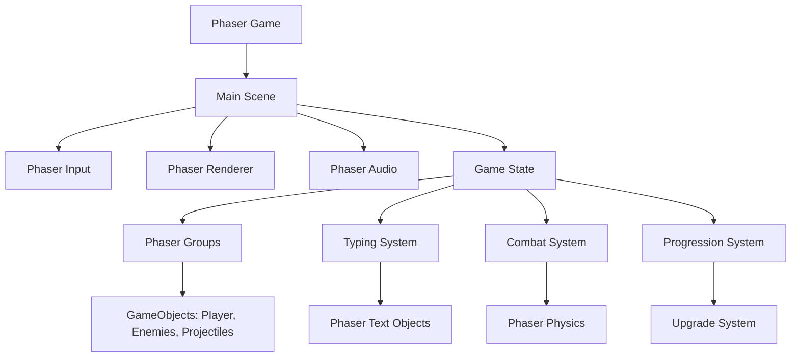

# Design Document

## Overview

The typing bullet-hell game is a web-based real-time game that combines fast-paced typing mechanics with survival gameplay. The architecture prioritizes performance, responsive input handling, and modular design to support the complex interactions between typing, combat, and progression systems.

## Architecture

### High-Level Architecture with Phaser.js



### Core Systems

1. **Phaser Game**: Main game instance managing scenes, input, rendering, and audio
2. **Main Scene**: Primary game scene extending Phaser.Scene, coordinating all game systems
3. **Phaser Groups**: Built-in entity management for efficient object pooling and updates
4. **Typing System**: Manages text display using Phaser.GameObjects.Text and input validation
5. **Combat System**: Handles attack generation and collision detection using Phaser.Physics.Arcade
6. **Progression System**: Manages experience, leveling, and upgrade selection
7. **Phaser Built-ins**: Leverages Phaser's optimized rendering, input, and audio systems

## Components and Interfaces

### Entity System with Phaser

```typescript
interface GameObject extends Phaser.GameObjects.Sprite {
	health: number;
	maxHealth: number;
	gameUpdate(time: number, delta: number): void;
}

interface Enemy extends GameObject {
	damage: number;
	experienceValue: number;
	movementPattern: MovementPattern;
	target: Phaser.Math.Vector2;
}

interface Projectile extends GameObject {
	damage: number;
	target: Enemy | null;
	speed: number;
}
```

### Typing System with Phaser

```typescript
interface TypingSystem {
	currentText: string;
	typedText: string;
	scrollPosition: number;
	wordsCompleted: number;
	textObject: Phaser.GameObjects.Text;

	updateText(deltaTime: number): void;
	processInput(character: string): boolean;
	onWordComplete(): void;
	generateNewText(): void;
}

interface TextRenderer {
	renderScrollingText(
		textObject: Phaser.GameObjects.Text,
		text: string,
		position: number
	): void;
	highlightTypedText(
		textObject: Phaser.GameObjects.Text,
		typedLength: number
	): void;
}
```

### Combat System

```typescript
interface CombatSystem {
	autoTargeting: AutoTargeting;
	projectileManager: ProjectileManager;

	launchAttack(attackPower: number, multiHit: number): void;
	selectTarget(): Enemy | null;
	processCollisions(): void;
}

interface AutoTargeting {
	findNearestEnemy(): Enemy | null;
	findWeakestEnemy(): Enemy | null;
	prioritizeTarget(enemies: Enemy[]): Enemy;
}
```

### Progression System

```typescript
interface ProgressionSystem {
	level: number;
	experience: number;
	experienceToNext: number;
	availableUpgrades: BaseUpgrade[];

	addExperience(amount: number): void;
	levelUp(): void;
	selectUpgrade(upgrade: BaseUpgrade): void;
	generateUpgradeChoices(): BaseUpgrade[];
}

abstract class BaseUpgrade {
	abstract id: string;
	abstract name: string;
	abstract description: string;
	abstract rarity: UpgradeRarity;
	abstract maxLevel: number;
	currentLevel: number = 0;
	
	abstract apply(player: Player): void;
	abstract getDescription(level: number): string;
	canUpgrade(): boolean { return this.currentLevel < this.maxLevel; }
}

enum UpgradeRarity {
	COMMON = 'common',
	RARE = 'rare',
	EPIC = 'epic',
	LEGENDARY = 'legendary'
}

// Offensive Upgrade Categories
abstract class ProjectileUpgrade extends BaseUpgrade {
	category = 'projectile';
}

abstract class AOEUpgrade extends BaseUpgrade {
	category = 'aoe';
}

abstract class SpecialWeaponUpgrade extends BaseUpgrade {
	category = 'special_weapon';
}

abstract class SentenceUpgrade extends BaseUpgrade {
	category = 'sentence';
}

// Defensive Upgrade Categories
abstract class HealthUpgrade extends BaseUpgrade {
	category = 'health';
}

abstract class ShieldUpgrade extends BaseUpgrade {
	category = 'shield';
}

abstract class DeflectionUpgrade extends BaseUpgrade {
	category = 'deflection';
}

abstract class AuraUpgrade extends BaseUpgrade {
	category = 'aura';
}

abstract class TemporalUpgrade extends BaseUpgrade {
	category = 'temporal';
}
```

## Data Models

### Game State

```typescript
interface GameState {
	player: Player;
	enemies: Enemy[];
	projectiles: Projectile[];
	typingSystem: TypingSystem;
	progressionSystem: ProgressionSystem;
	gameTime: number;
	score: number;
	isGameActive: boolean;
}

interface Player {
	health: number;
	maxHealth: number;
	position: Vector2;
	attackPower: number;
	attackMultiplier: number;
	typingSpeed: number;
	level: number;
	
	// Projectile upgrades
	projectileCount: number;
	piercingCount: number;
	hasSeekingProjectiles: boolean;
	seekingStrength: number;
	
	// AOE upgrades
	hasWordBlast: boolean;
	blastRadius: number;
	blastDamage: number;
	hasChainLightning: boolean;
	chainJumps: number;
	chainRange: number;
	
	// Special weapons
	hasLaserBeam: boolean;
	laserDamagePerSecond: number;
	laserWidth: number;
	turretCount: number;
	turretDamage: number;
	
	// Sentence upgrades
	hasSentenceSlam: boolean;
	sentenceDamageMultiplier: number;
	hasComboSystem: boolean;
	maxComboMultiplier: number;
	
	// Health & regen
	hasRegeneration: boolean;
	regenRate: number;
	
	// Shields
	hasTypingShield: boolean;
	shieldPerWord: number;
	maxShield: number;
	currentShield: number;
	hasWordBarrier: boolean;
	barrierStrength: number;
	
	// Deflection & Reflection
	hasProjectileDeflection: boolean;
	deflectionChance: number;
	hasDamageReflection: boolean;
	reflectionDamage: number;
	
	// Aura & Area Control
	hasSlowingAura: boolean;
	slowAuraRadius: number;
	slowStrength: number;
	hasDamageAura: boolean;
	auraRadius: number;
	auraDamagePerSecond: number;
	hasRepulsionField: boolean;
	repulsionRadius: number;
	repulsionStrength: number;
	
	// Temporal & Reality
	hasTimeDilation: boolean;
	dilationStrength: number;
	dilationDuration: number;
	hasRewind: boolean;
	rewindCharges: number;
	rewindHealAmount: number;
	hasStasisField: boolean;
	stasisDuration: number;
	stasisRadius: number;
	
	// Utility
	magnetRange: number;
	magnetStrength: number;
}
```

### Text Content

```typescript
interface TextContent {
	sentences: string[];
	currentSentenceIndex: number;
	difficulty: TextDifficulty;

	getNextSentence(): string;
	adjustDifficulty(level: number): void;
}

enum TextDifficulty {
	EASY = 'easy',
	MEDIUM = 'medium',
	HARD = 'hard',
	EXPERT = 'expert',
}
```

## Error Handling

### Input Validation

- Graceful handling of invalid keystrokes without breaking typing flow
- Prevention of rapid-fire input exploitation
- Fallback for unsupported keyboard layouts

### Performance Degradation

- Dynamic quality scaling when frame rate drops below 45fps
- Entity culling for off-screen objects
- Reduced particle effects under performance stress

### Browser Compatibility

- Feature detection for Canvas 2D and Web Audio API
- Graceful fallbacks for older browsers
- Clear error messages for unsupported features

## Testing Strategy

### Unit Testing

- **Typing System**: Input validation, word completion detection, text scrolling
- **Combat System**: Auto-targeting algorithms, collision detection, damage calculation
- **Progression System**: Experience calculation, level-up triggers, upgrade application
- **Entity Management**: Creation, updating, and cleanup of game objects

### Integration Testing

- **Game Loop**: System coordination and timing
- **Input-to-Action**: Complete flow from keystroke to attack launch
- **State Transitions**: Game start, level up, game over scenarios

### Performance Testing

- **Frame Rate**: Consistent 60fps with 100+ entities
- **Memory Usage**: No memory leaks during extended gameplay
- **Input Latency**: Sub-50ms response time for typing input

### Browser Testing

- **Cross-browser**: Chrome, Firefox, Safari, Edge compatibility
- **Device Testing**: Desktop, tablet, and mobile responsiveness
- **Accessibility**: Keyboard navigation and screen reader support

## Technical Implementation Details

### Rendering Pipeline

- **Canvas 2D**: Primary rendering context for optimal browser support
- **Layered Rendering**: Background, entities, UI, and effects on separate layers
- **Object Pooling**: Reuse projectile and particle objects to reduce garbage collection
- **Viewport Culling**: Only render entities within visible screen area

### Game Loop Architecture

- **Fixed Timestep**: 60fps update rate with variable rendering
- **Delta Time**: Smooth movement regardless of frame rate fluctuations
- **System Priority**: Input → Logic → Rendering → Audio

### Input System

- **Event-driven**: Immediate response to keydown events
- **Input Buffer**: Queue system to handle rapid typing
- **Key Mapping**: Support for different keyboard layouts and languages

### Audio System

- **Web Audio API**: Low-latency sound effects and background music
- **Audio Pooling**: Reuse audio nodes for frequent sound effects
- **Dynamic Mixing**: Adjust volume based on game intensity
